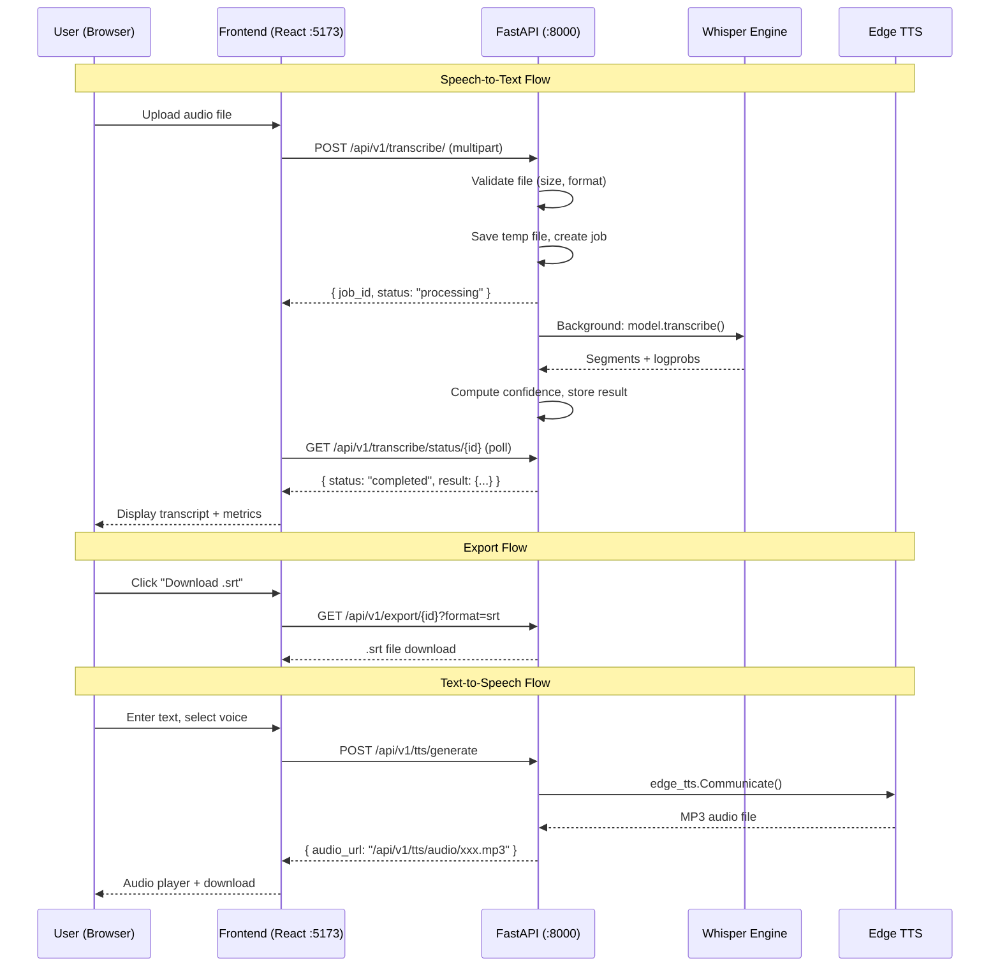

# TranscribeAI — Architecture & Design

## System Overview

TranscribeAI is a self-hosted speech processing platform with two core capabilities:

1. **Speech-to-Text (STT)** — Upload audio/video → get a timestamped transcript with per-segment confidence scores
2. **Text-to-Speech (TTS)** — Input text → generate natural-sounding audio in multiple languages

The system follows a classic **client-server** architecture, with a decoupled React frontend and FastAPI backend communicating over REST.

---

## Architecture Diagram



---

## Component Breakdown

### Frontend (React + Vite + TypeScript)
- **Single-page app** with two tabs: Transcribe and TTS
- **Glassmorphism UI** with Inter font, CSS custom properties
- Communicates via Axios; polls for job completion every 2s
- Client-side file validation (25 MB limit, format check)

### Backend API (FastAPI)
- **Structured JSON logging** with request timing middleware
- **Pydantic v2 Settings** for typed environment configuration
- **Exception handlers** for file-too-large (413), not-found (404), internal errors
- **Health endpoint** returns uptime, version, and model info

### Whisper Transcription Service
- Lazy-loads model on first request (avoids startup delay if unused)
- Converts Whisper's `avg_logprob` to a 0-1 confidence score via `exp(clamp(logprob, -1, 0))`
- Tracks processing time and file size per job
- Runs in FastAPI background tasks (async-compatible)

### SRT Export Service
- Converts transcript segments → standard `.srt` format
- Supports three export formats: SRT, TXT, JSON

### TTS Service (Edge TTS)
- Uses Microsoft Edge TTS (free, 300+ voices, high quality)
- Generates MP3 files, served via `FileResponse`
- Supports rate and pitch adjustment

---

## Data Flow

```
Upload → Validate → Save temp file → Create job (in-memory dict)
  → Background task: Whisper transcribe → Compute confidence
  → Store result in jobs dict → Client polls status → Return result
  → Optional: Export as SRT/TXT/JSON
```

**Job storage**: In-memory Python dict (`jobs = {}`) — simple for MVP, loses state on restart.

---

## Trade-offs

| Decision | Chosen | Alternative | Rationale |
|----------|--------|-------------|-----------|
| **Job storage** | In-memory dict | Redis / PostgreSQL | MVP simplicity, < 100 concurrent users |
| **STT engine** | openai-whisper | faster-whisper | Wider compatibility, standard API |
| **TTS engine** | edge-tts | gTTS, Coqui TTS | Free, high quality, 300+ voices, no API key |
| **Processing** | Background tasks | Celery + Redis | No additional infra needed for MVP |
| **Frontend** | Single SPA | SSR (Next.js) | Simple deployment, no SEO needs |
| **Confidence** | exp(avg_logprob) | Per-word probability | Segment-level is sufficient, less noise |
| **File handling** | Temp files + cleanup | Object storage (S3) | Self-hosted, no cloud dependency |

---

## Future Improvements

1. **Speaker Diarization** — Identify who is speaking using pyannote or similar
2. **Real-time Streaming** — WebSocket-based live transcription
3. **Webhook Callbacks** — Notify external services when jobs complete
4. **Redis Job Queue** — Persistent job state, multi-worker support
5. **GPU Acceleration** — CUDA support in Docker for faster inference
6. **Rate Limiting** — Per-IP or API-key rate limits
7. **User Authentication** — JWT-based auth for multi-tenant deployments
8. **Batch Processing** — Upload multiple files, process in parallel

---

## API Reference

Full API documentation is auto-generated at:
- **Swagger UI**: http://localhost:8000/docs
- **ReDoc**: http://localhost:8000/redoc
- **Detailed guide**: [docs/API_GUIDE.md](./API_GUIDE.md)
